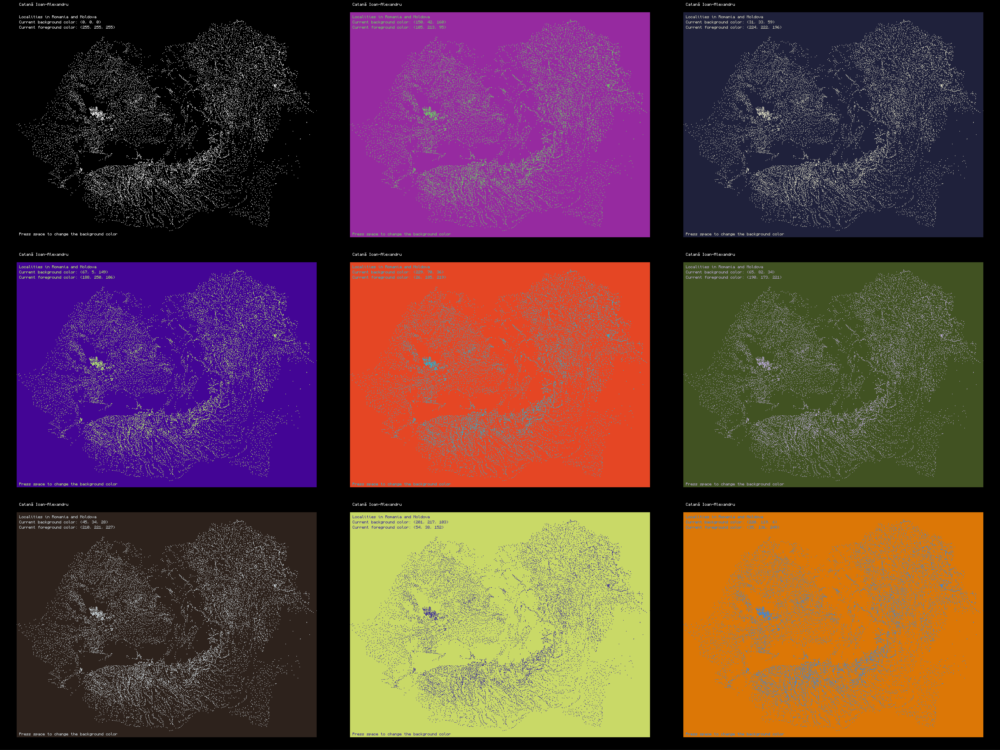

# mercator-map
A python program that combines the pandas and pygame libraries to process raw geographical information (provided by Geonames) in order to display them to the screen using the ubiquitous Mercator projection.

# installation
```
cd mercator-map
pip install -r requirements
python main.py
```


